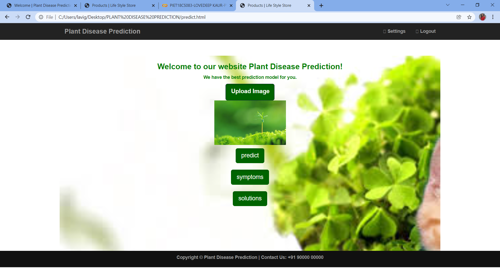

# Plant-Disease-Diagnosis-Flask
Online Flask Web App for Plant Disease Diagnosis from Images <br>

<br><br>

## Required Tools
```
Python 3.6 or greater, Tensorflow 2, Flask, Gevent, Scikit-Learn
```

## Dataset

https://www.kaggle.com/emmarex/plantdisease


